# Project 1 - Make 구현 화면

Google Sheets에 접수된 문의를 긴급/일반으로 분류하고, 처리 시트 기록과 Discord 알림을 실행하는 Make Scenario의 구성 및 실행 결과이다.

> 보안 주의: 저장소 공개 전 Webhook URL, API Key, 토큰, Google 계정 이메일 및 Spreadsheet ID가 화면에 노출되지 않았는지 다시 확인한다.

## 1. 전체 Scenario

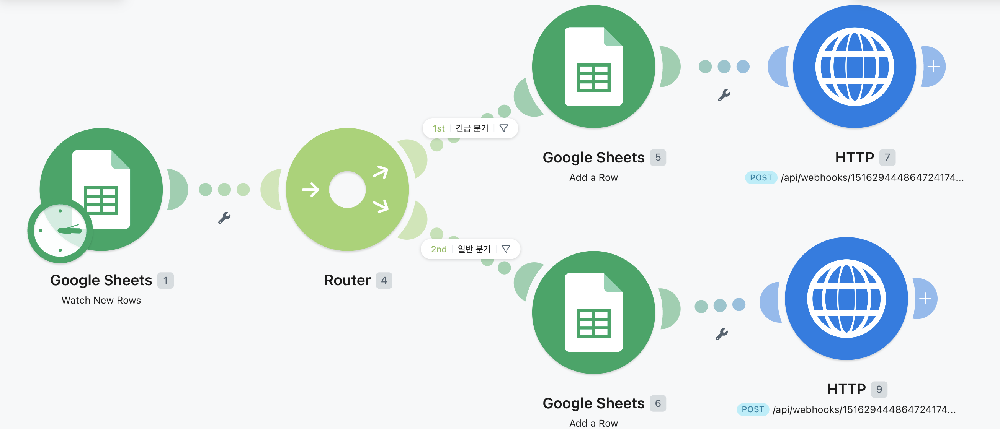

Google Sheets Trigger 이후 Router가 긴급/일반 경로를 나누고, 각 경로에서 행 추가와 Discord HTTP 요청을 실행하는 전체 흐름이다.

## 2. Google Sheets Trigger

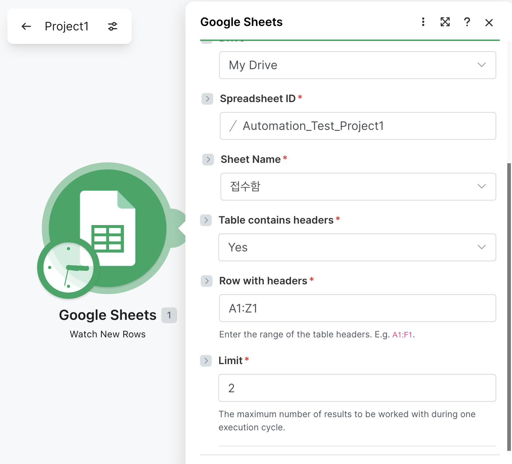

문의 접수 시트의 새 행을 감지하여 Scenario를 시작하는 Trigger 설정이다.

## 3. 긴급 분기 Router/Filter

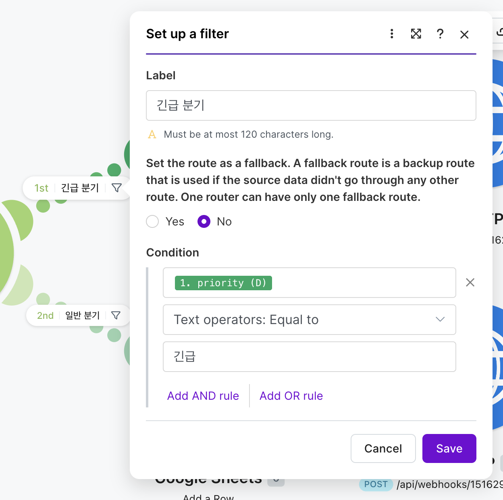

입력 데이터의 우선순위 값이 '긴급'인 경우에만 긴급 처리 경로를 실행하도록 구성한 Filter이다.

## 4. 일반 분기 Router/Filter

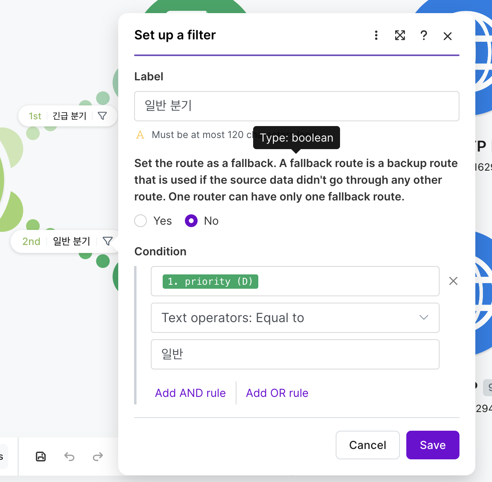

입력 데이터의 우선순위 값이 '일반'인 경우 일반 처리 경로로 전달하는 Filter이다.

## 5. 긴급처리 시트 행 추가

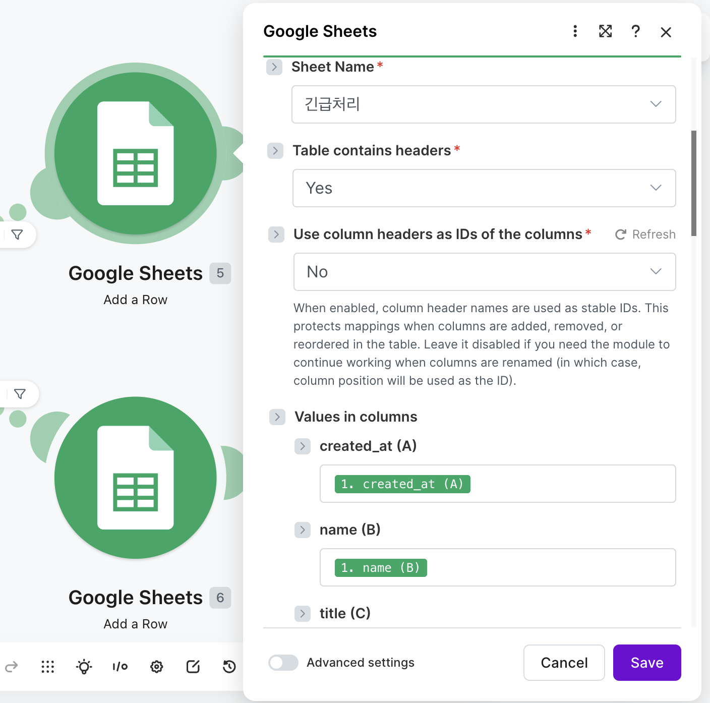

긴급 문의 데이터를 Google Sheets의 긴급처리 시트에 기록하는 Add a Row 모듈 설정이다.

## 6. 일반처리 시트 행 추가

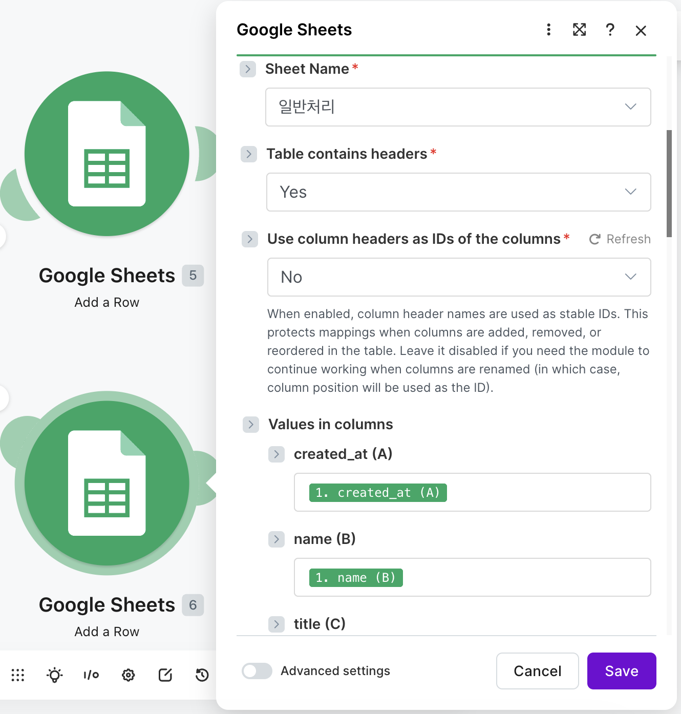

일반 문의 데이터를 Google Sheets의 일반처리 시트에 기록하는 Add a Row 모듈 설정이다.

## 7. 긴급 Discord 알림

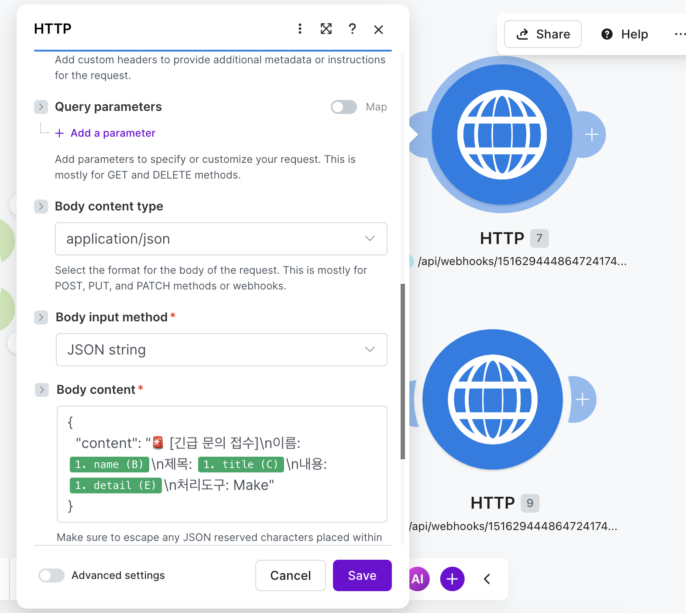

긴급 문의의 이름, 제목, 내용 등을 JSON 메시지로 구성하여 Discord에 전송하는 HTTP 모듈이다.

## 8. 일반 Discord 알림

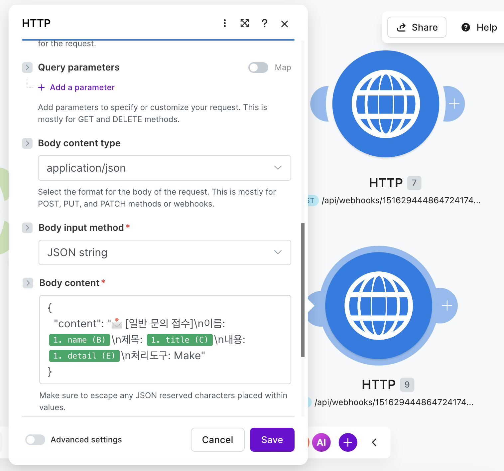

일반 문의 정보를 별도의 메시지 형식으로 구성하여 Discord에 전송하는 HTTP 모듈이다.

## 9. 실행 기록

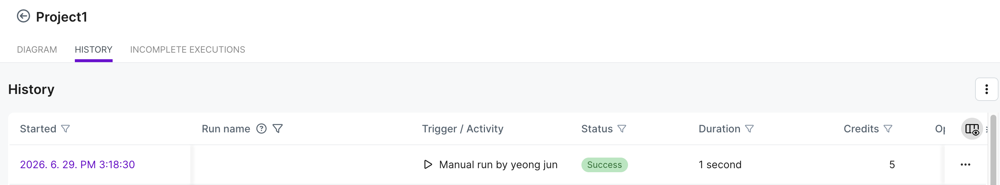

Scenario가 각 모듈과 분기를 거쳐 실행된 결과를 확인하는 Make 실행 로그 화면이다.

## 10. Google Sheets 결과

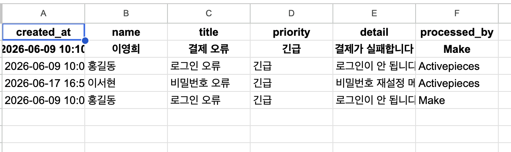

분기된 문의 데이터가 해당 처리 시트에 정상적으로 추가된 결과이다.

## 11. Discord 결과

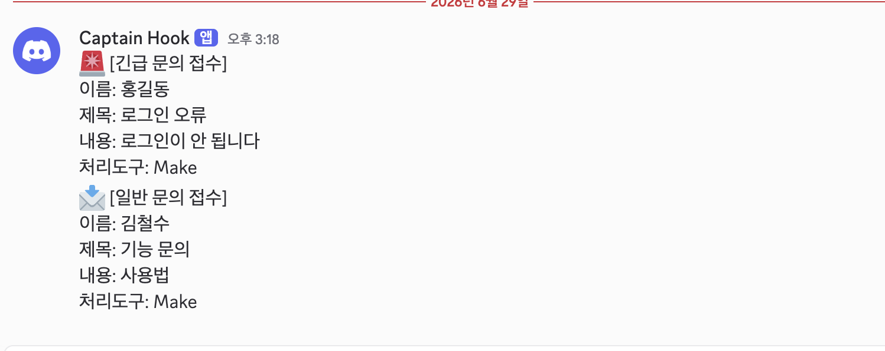

HTTP 요청으로 생성한 문의 알림이 Discord 채널에 도착한 최종 결과이다.
