# Project 1 - Activepieces 구현 화면

Make와 동일한 문의 분류 자동화를 Activepieces로 구현한 Flow의 구성 및 실행 결과이다.

> 보안 주의: 저장소 공개 전 Webhook URL, API Key, 토큰, Google 계정 이메일 및 Spreadsheet ID가 화면에 노출되지 않았는지 다시 확인한다.

## 1. 전체 Flow

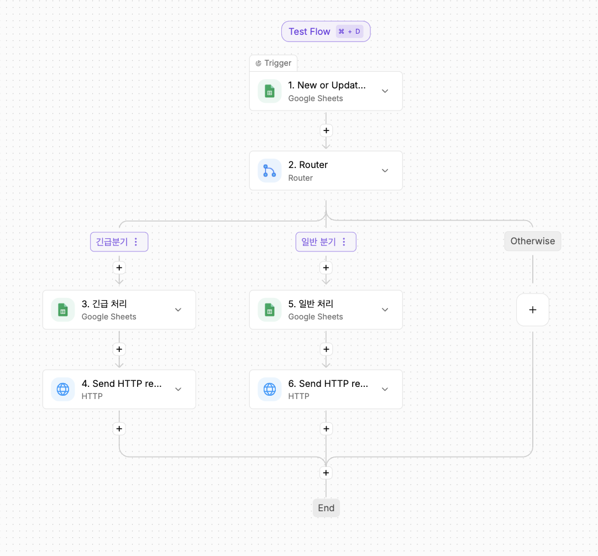

Google Sheets Trigger, Router, 긴급/일반 처리 시트 기록, HTTP 알림 단계로 구성한 전체 Flow이다.

## 2. Google Sheets Trigger

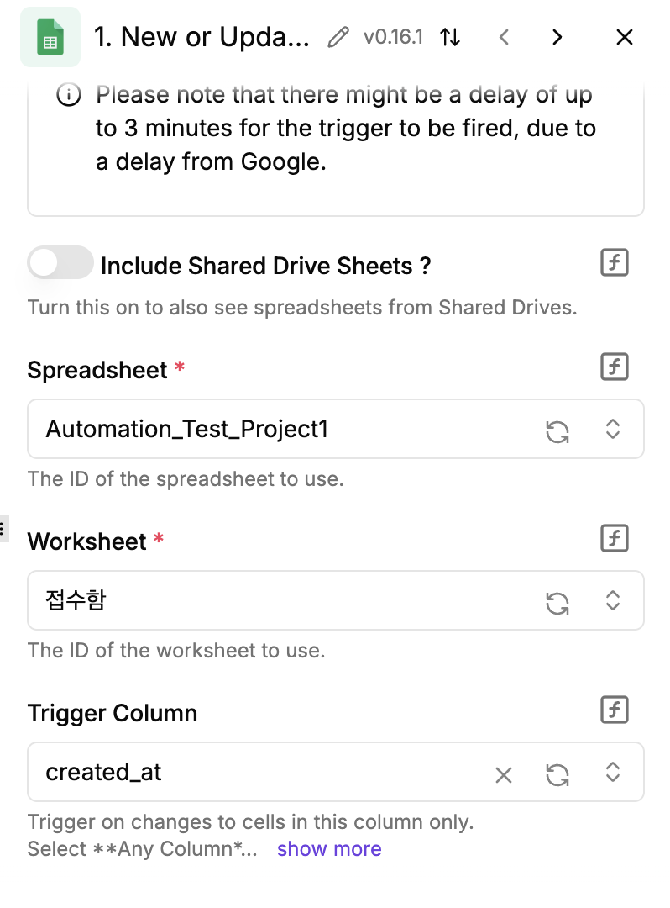

Google Sheets의 새 행 또는 변경된 행을 감지하여 Flow를 실행하는 Trigger 설정이다.

## 3. 긴급 분기 Router

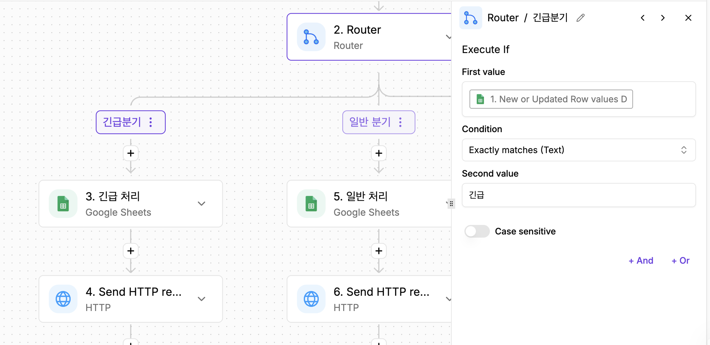

Trigger 출력의 우선순위 값이 '긴급'과 정확히 일치할 때 긴급 분기를 실행하도록 구성한 Router 조건이다.

## 4. 일반 분기 Router

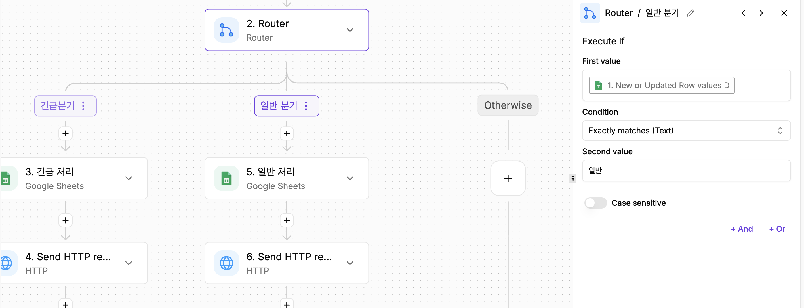

Trigger 출력의 우선순위 값이 '일반'과 정확히 일치할 때 일반 분기를 실행하도록 구성한 Router 조건이다.

## 5. 긴급처리 시트 행 추가

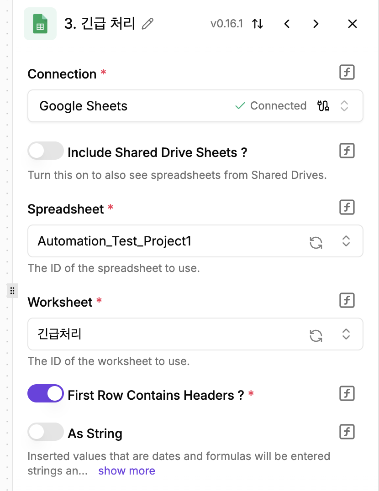

긴급 문의의 입력값을 Google Sheets의 긴급처리 워크시트에 추가하는 단계이다.

## 6. 일반처리 시트 행 추가

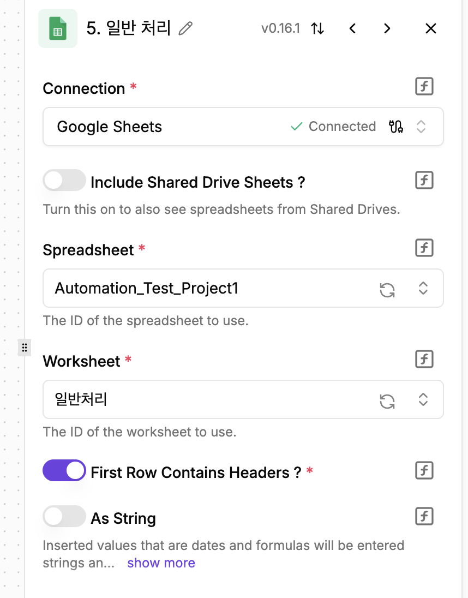

일반 문의의 입력값을 Google Sheets의 일반처리 워크시트에 추가하는 단계이다.

## 7. 긴급 Discord HTTP 요청

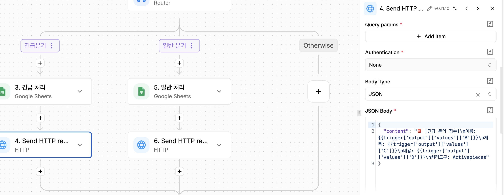

긴급 문의의 이름, 제목과 내용을 JSON Body로 구성하여 Discord Webhook으로 전송하는 HTTP Request 단계이다.

## 8. 일반 Discord HTTP 요청

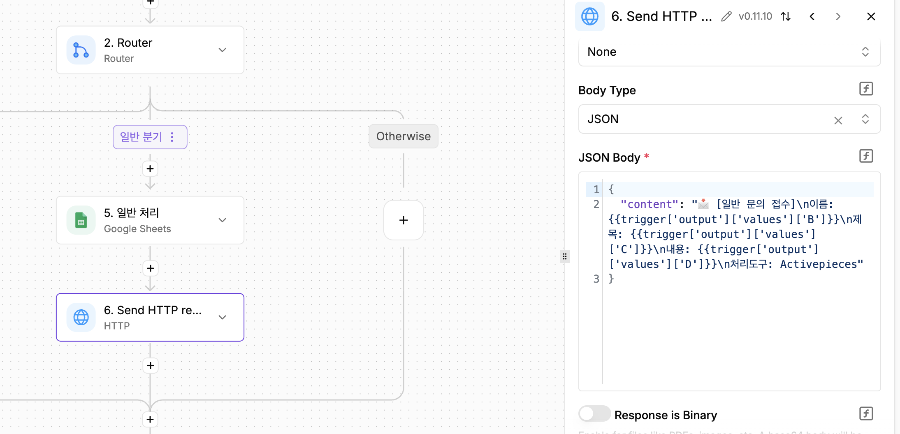

일반 문의의 이름, 제목과 내용을 별도의 JSON 메시지로 구성하여 Discord Webhook으로 전송하는 HTTP Request 단계이다.

## 9. Runs 실행 기록

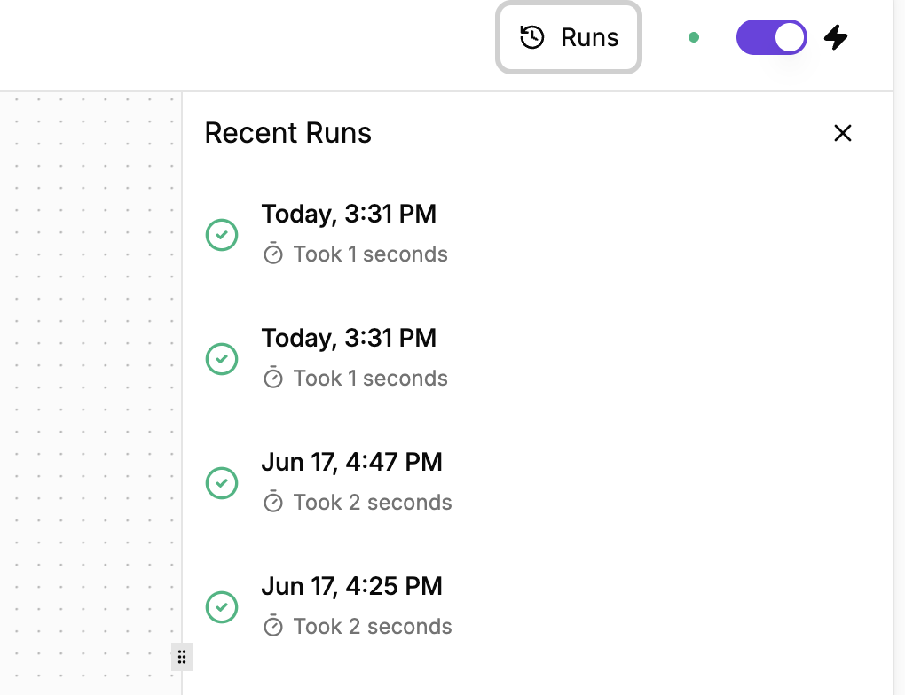

Flow가 성공적으로 실행된 시각과 처리 시간을 확인할 수 있는 Recent Runs 화면이다.

## 10. Google Sheets 결과

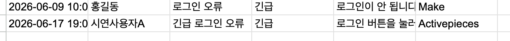

긴급/일반 분기 결과가 각각의 처리 시트에 기록된 모습이다.

## 11. Discord 결과

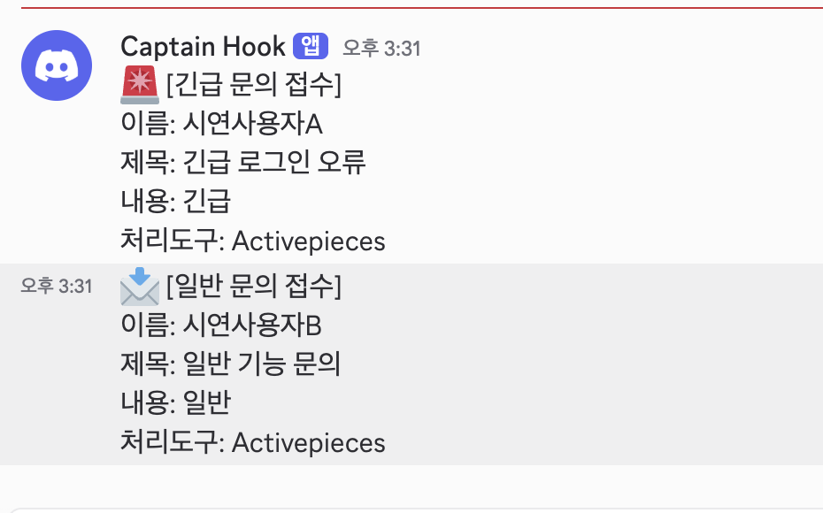

Activepieces의 HTTP Request를 통해 Discord 채널에 알림이 전달된 최종 결과이다.
