# Project 2 - Make 구현 화면

Google Sheets에 등록된 할 일을 우선순위에 따라 중요/일반으로 분류하고, 로그 기록과 Discord 알림을 실행하는 Make Scenario의 구성 및 실행 결과이다.

> 보안 주의: 저장소 공개 전 Webhook URL, API Key, 토큰, Google 계정 이메일 및 Spreadsheet ID가 화면에 노출되지 않았는지 다시 확인한다.

## 1. 전체 Scenario

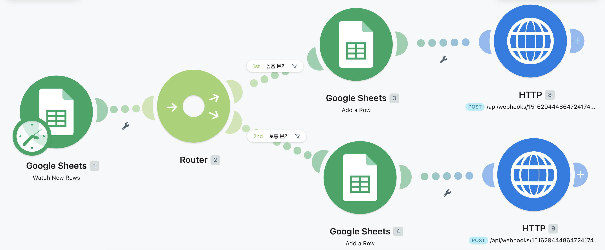

Google Sheets Trigger, Router, 중요/일반 로그 기록, Discord 알림으로 이어지는 프로젝트 2 전체 자동화 흐름이다.

## 2. Google Sheets Trigger

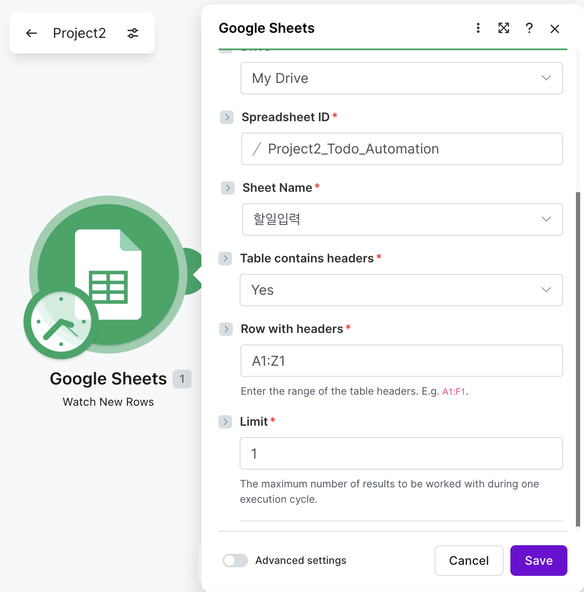

할 일 입력 시트에 새 행이 추가되면 Scenario를 시작하도록 구성한 Trigger이다.

## 3. 중요 할 일 분기

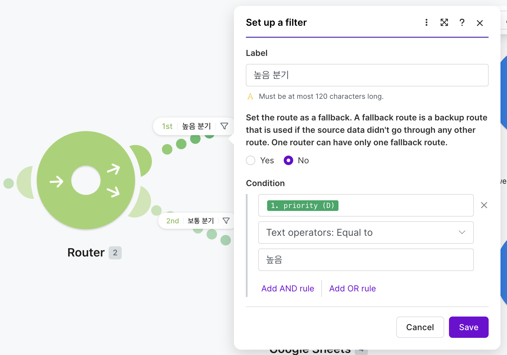

'priority = 높음' 조건을 만족하는 할 일을 중요 처리 경로로 보내는 Router/Filter 설정이다.

## 4. 일반 할 일 분기

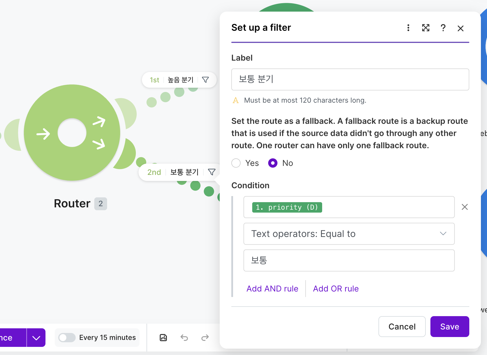

'priority = 보통' 조건을 만족하는 할 일을 일반 처리 경로로 보내는 Router/Filter 설정이다.

## 5. 중요할일로그 행 추가

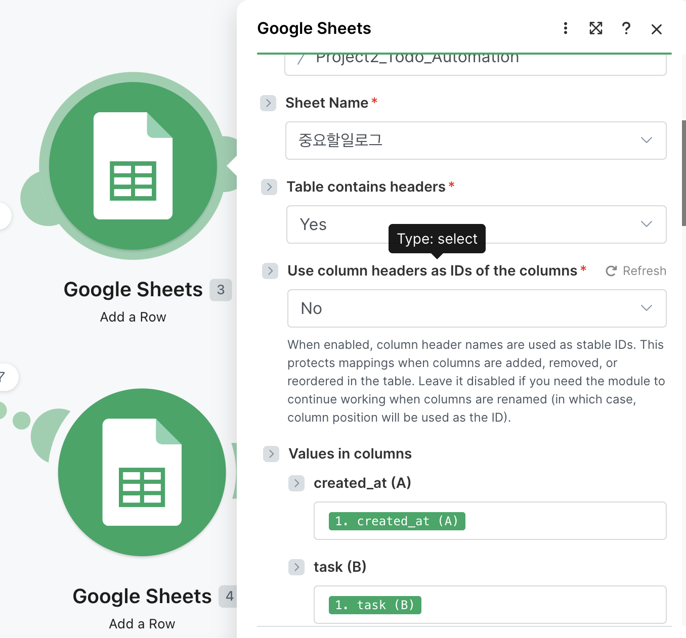

중요 할 일의 작업명, 분류, 마감일과 메모를 중요할일로그 시트에 기록하는 모듈이다.

## 6. 일반할일로그 행 추가

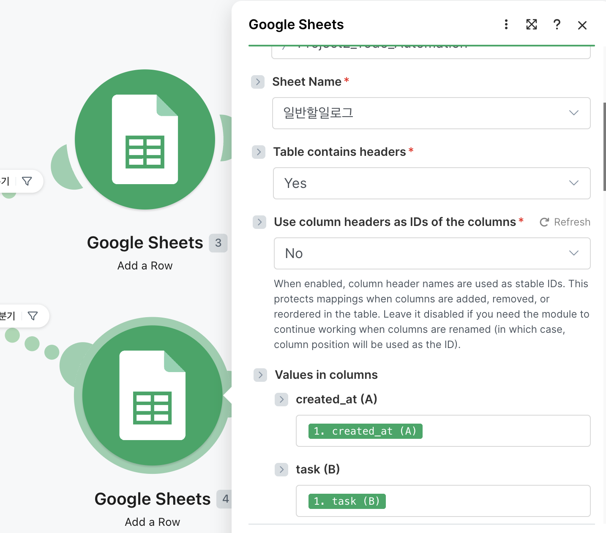

일반 할 일 데이터를 일반할일로그 시트에 기록하는 Add a Row 모듈이다.

## 7. 중요 할 일 Discord 알림

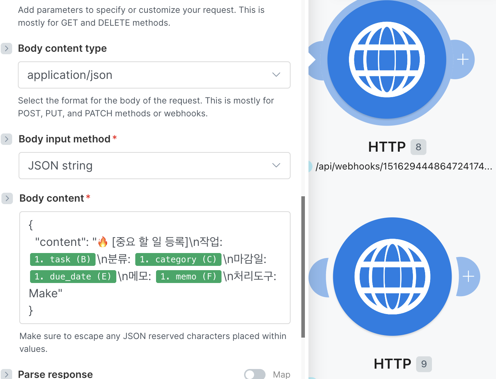

중요 할 일 정보를 강조된 JSON 메시지로 구성하여 Discord에 전송하는 HTTP 모듈이다.

## 8. 일반 할 일 Discord 알림

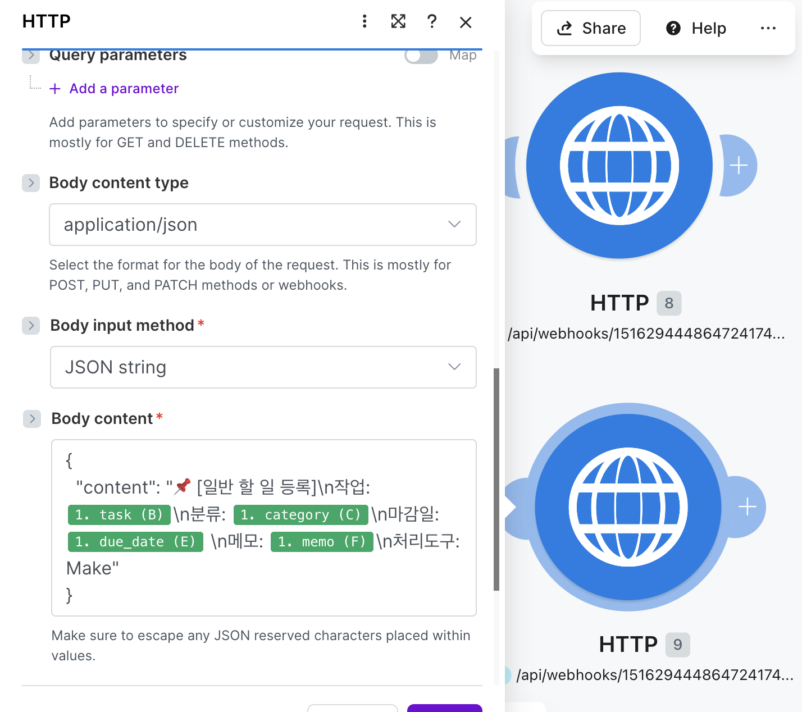

일반 할 일 정보를 JSON 메시지로 구성하여 Discord에 전송하는 HTTP 모듈이다.

## 9. 실행 기록

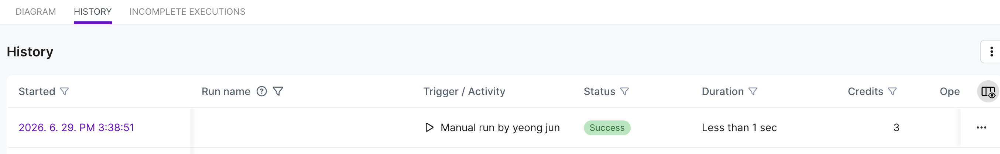

프로젝트 2 Scenario의 모듈별 처리 여부와 실행 결과를 확인하는 로그 화면이다.

## 10. Google Sheets 결과

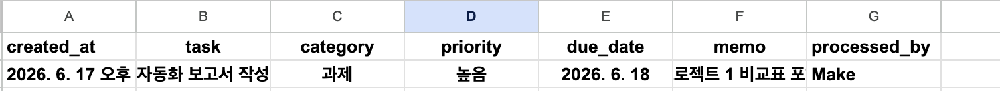

우선순위에 따라 할 일 데이터가 중요할일로그 또는 일반할일로그 시트에 기록된 결과이다.

## 11. Discord 결과

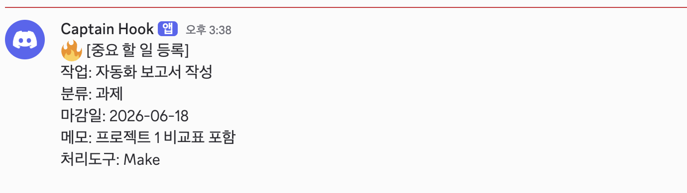

중요/일반 할 일 알림이 Discord 채널에 전달된 최종 결과이다.
